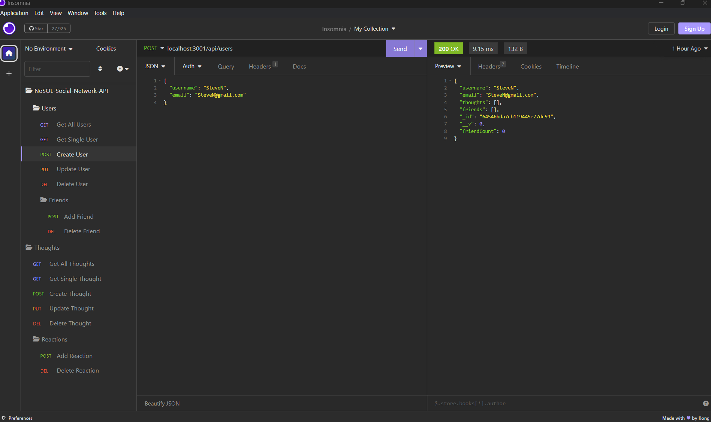

### Rutgers-Module13 (NoSQL Social-Network-API)

# This project is a NoSQL API that's been built for a Social Network application.

## We have a `user model`, `thought Model`, and a ` reaction schema` used in the thought model.

# Installation

After cloning this repository, run the following commands in the terminal. `npm run seed` and `npm run dev`. After running these commands, open Insomnia or Postman and get started.

# Use

This application can be used with the following routes to perform CRUD operations.

### User Routes:

- GET All Users: `localhost:3001/api/users`
- GET A User: `localhost:3001/api/users/ (User ID)`
- POST A User: `localhost:3001/api/users` and inlude username and email as a JSON body.
- PUT A User: `localhost:3001/api/users/ (User ID)` and inlude username and email as a JSON body.
- DELETE A User: `localhost:3001/api/users/ (User ID)`

### Friend Routes:

- POST Friend: `localhost:3001/api/users/ (User ID) /friends/ (Friend ID)`
- DELETE Friend: `localhost:3001/api/users/ (User ID) /friends/ (Friend ID)`

### Thought Routes:

- GET All Thoughts: `localhost:3001/api/thoughts`
- GET A Thought: `localhost:3001/api/thoughts/ (Thought ID)`
- POST A Thought: `localhost:3001/api/thoughts` and inlude thoughtText and username as a JSON body.
- PUT A Thought: `localhost:3001/api/thoughts/ (Thought ID)` and inlude thoughtText as a JSON body.
- DELETE A Thought: `localhost:3001/api/thoughts/ (Thought ID)`

### Reaction Routes:

- POST A Reaction: `localhost:3001/api/thoughts/ (Thought ID) /reactions` and include reactionBody and username as a JSON body.
- DELETE A Reaction: `localhost:3001/api/thoughts/ (Thought ID) /reactions/ (Reaction ID)`

### Sample Image

## License

This project uses the license:

